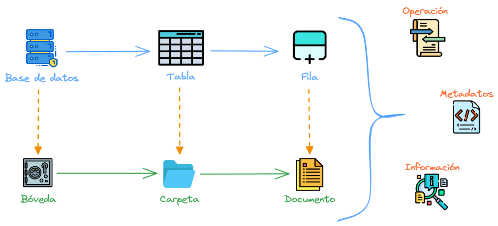
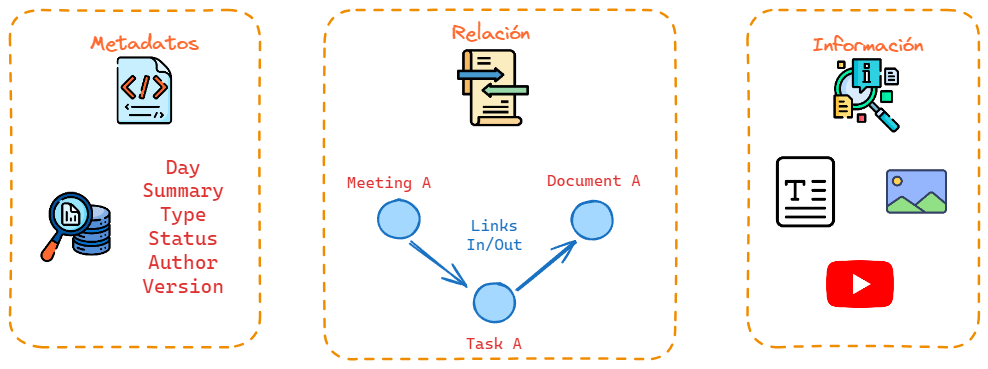

# Introducción
## Objetivo
La base documental tiene como objetivo centralizar, organizar, catalogar y disponer de una manera mas rápida y eficiente la información, facilitando la productividad de los equipos como la mejora continua de los proyectos.
## Analogía
Una base documental es lo más cercano a una base de datos, pero esta misma almacena la información en archivos o documentos, normalmente en tipo de extensión [Markdown(.md)](https://www.markdownguide.org/) , logrando una forma de edición mas rápida y flexible.

## Documento
Los documentos son la unidad mas chica de una base documental, para poder trabajar con ellos utilizamos tres características que pertenecen a cada documento.

### Metadatos
Los metadatos en un documento son información adicional que proporciona detalles sobre el propio documento. Estos datos incluyen el título, autor, fecha de creación, formato de archivo, palabras clave y otros detalles relevantes que ayudan a describir y organizar el contenido. Los metadatos son esenciales para facilitar la búsqueda, la gestión y la comprensión de los documentos, ya que ofrecen contexto y estructura a la información contenida en el documento.
!!! info
    En algunas herramientas como Obsidian, que veremos más adelantes, hay metadatos por defecto, generados por la herramienta, por ejemplo "fecha de creación","fecha de modificación","ruta del archivo" entre otros.
### Relación 
En el contexto de la gestión de documentos, la relación entre documentos se establece mediante enlaces, que pueden ser de dos tipos principales: enlaces entrantes (link in) y enlaces salientes (link out).

- **Link in (enlace entrante)**: Un enlace entrante, o link in, se refiere a un enlace que apunta hacia un documento específico desde otro documento o recurso externo. Por ejemplo, como en la [imagen](assets/images/base-documental-documento.png) se observa que el documento "Meeting A" es un enlace entrante del documento "Task A".

- **Link out (enlace saliente)**: Un enlace saliente, o link out, es aquel que parte de un documento hacia otro recurso externo. Por ejemplo, como en la [imagen](assets/images/base-documental-documento.png) se observa que el documento "Document A" es un enlace saliente del documento "Task A".
### Información
La información dentro de un documento puede estar constituida por texto, imágenes, enlaces webs, videos (ej. YouTube), hasta otros documentos dentro de la misma bóveda de la base documental, evitando la redundancia de información y permitiendo una centralización de la información, como los métodos de búsquedas y accesibilidad a la información.
## Bóveda
La bóveda se determina como el repositorio de documentos para un cliente o área en específico, donde cada equipo de trabajo está asignado a un grupo de Google, con los correspondientes permisos y accesos en la gestión de la bóveda.
Haciendo clic en  **[Mis Grupos](https://groups.google.com/my-groups)** podemos visualizar los grupos en los que estamos asignados.
!!! warning
    Cualquier problema de accesos o no estar en el grupo correspondiente, comunicarse con el Líder o IT.

Estos mismos grupos están asignado en nuestras correspondientes bóvedas o carpetas de **[Google Drive](https://drive.google.com/drive/u/0/shared-with-me?q=type:folder%20owner:info%40taligent.com.ar**)**, las cuales son compartidas por el usuario **Info Taligent**, que es administrado por el equipo de IT Taligent.

!!! info
    Una persona puede pertenecer a una o más bóvedas, con distintos permisos en cada una (Lectura o Escritura)
## Marco de Trabajo
En nuestro marco de trabajo de la Base Documental utilizaremos la herramienta [Obsidian](https://obsidian.md/), que nos permite trabajar localmente con archivos Markdown y poder editar, buscar y catalogar de forma practica los documentos que vayamos gestionando en nuestra bóveda. 
## Estructura
La estructura de carpetas de la bóveda se define bajo cada uno de los tipos de documentos que son necesarios en toda gestión de proyectos dentro de una base documental.

Para determinar el uso de cada uno de los distintos tipos de documentos, se necesita comprender un flujo de trabajo dentro de la base documental.

:material-arrow-right-thick:[Flujo de Trabajo](workflow/index.md)