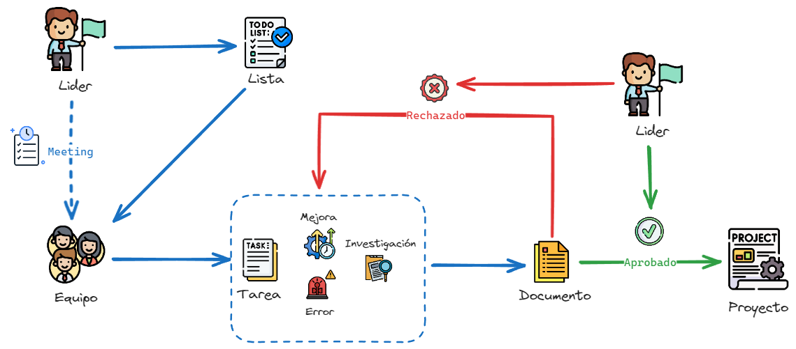

# Resumen
Un flujo de trabajo efectivo en el uso de la base documental, es importante tener en cuenta varios aspectos, como la creación, el acceso, la edición, la revisión y la gestión de los documentos. Aquí te presento un ejemplo de un flujo de trabajo general que puedes adaptar según las necesidades y procesos específicos de tu organización.

Podemos determinar que el líder coordina las tareas del proyecto, las prioridades y fechas de entrega. Como también la designación de tareas a cada persona del equipo (Normalmente se realiza en reuniones "Daily" o "Weekly" para realizar estos lineamientos, creando un documento de reunión o "Meeting"). 
El equipo correspondiente realiza las distintas tareas dependiendo el tipo de tareas:

- Mejora, se determina cuando hay un cambio o actualización en el servicio o recurso del proyecto.
- Error, se determina cuando hay un problema en el proceso o recurso que impide la continuidad del sistema o procesos del proyecto.
- Investigación, se determina como el espacio para la búsqueda e investigación de un concepto nuevo, herramienta o tecnología para la cual podría ser aplicada en el proyecto.
!!! note
    Cabe aclarar que pueden existir en los distintos proyectos mayor o menor cantidad de tipos de tareas.

Una vez finalizada la tarea, se debe generar un documento al respecto, para dicha aprobación del Líder, y poder ser incluido a los documentos del proyecto. En caso de ser rechazado por el líder, se debe volver a revisar la tarea en caso que se obviaron procesos o detalles en el cierre del documento.
!!! warning
    La gestión de tareas no esta incluida dentro de la base documental.

Los documentos tienen un modelo a partir de una plantilla o Template, para reducir el tiempo de edición, y poder facilitar el tiempo al equipo.
!!! note
    Es necesario crear distintos templates de documentos a partir del tipo de tarea, para automatizar el proceso de lectura por parte del Líder.
