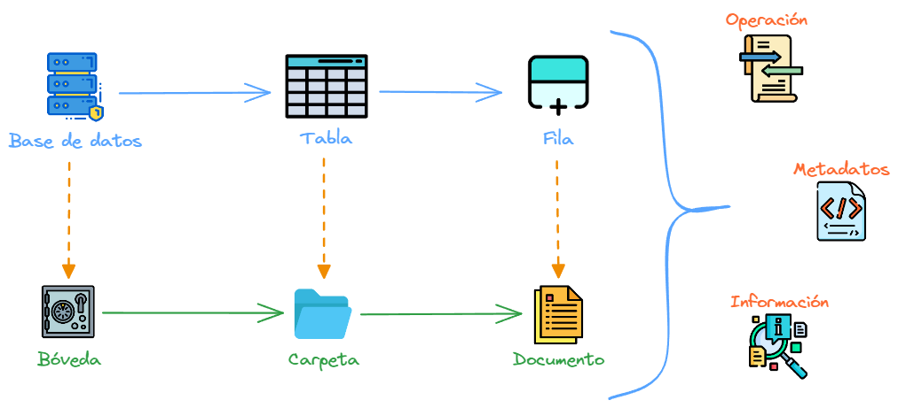

# Introducción
## ¿Que es una base documental?
La base documental tiene como propósito centralizar, organizar, acceder y buscar de una manera mas rápida y eficiente la información, facilitando la productividad de los equipos como la mejora continua de los proyectos.
## Analogia
Una base documental es lo mas cercano a una base de datos, pero esta misma almacena la información en archivos o documentos, normalmente en tipo de extensión [Markdown(.md)](https://www.markdownguide.org/) , logrando una forma de edición rápida y flexible.
